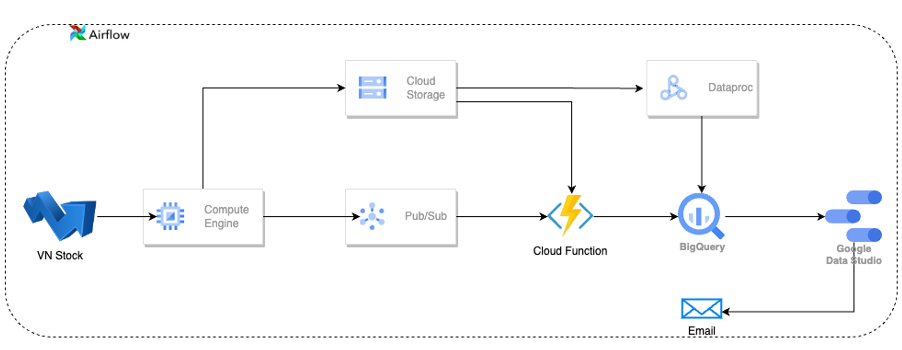

# [Airflow + Spark + GCP] VNStock Pipeline

## Introduction

Problem : To effectively participate in the stock market, you need to build a pipeline to gather complete data on the stock market and continuously update it with the latest information. This will enable you to predict and issue timely warnings when the stocks you are interested in show a declining trend.

   
  <i>Data flow</i>

## How to use

   - Clone my project : `git clone https://github.com/thangnh1/VNStock`
   - Config env, connection
   - Install packages
   - `get_stock_data.py` to retrieve the entire stock market data, and save the results to the file `data.csv`.
   - `load_stock_data.py` to upload `data.csv` file to GCS (Google Cloud Storage), and simultaneously create a BigQuery table to store the data.
   - `stock_data_daily.py` to update the data daily.
   - `stock_subscribe.py` to save the ticker of interest.
   - `publish_data_subscribe.py` to publish data of the subscribed stocks to Pub/Sub.
   - `stock_analysis_.py` for calculating stable growth stocks and then save them to BigQuery.
   - To run `stock_data_daily.py` and `publish_data_subscribe.py`, you need to create a Cloud Function and copy the code from `gcs_to_bigquery_function.py` and `pubsub_to_bigquery_function` for use. You can add `google.cloud` and `google.cloud.bigquery` to `requirements.txt`.
